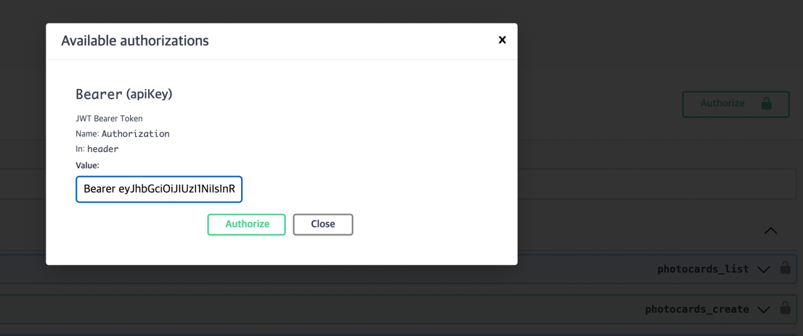

# poca_market_api
## 사용 기술
- Python(3.10)
- Django(5.0.7)
- Django DRF
- Postgresql
- redis
- celery
- django_extensions, black, isort, drf-yasg, silk
## 실행
1. 설정 파일을 생성합니다.(프로젝트 root 폴더/.credentials.json)
    ```json
   {
      "SECRET_KEY": "poca_market_secret_key",
       "DB": {
         "HOST": "localhost",
         "NAME" : "poca_market",
         "USER":  "",
         "PASSWORD":  "",
         "PORT":  5432
       },
       "REDIS": {
         "HOST": "redis://127.0.0.1:6379"
       }
    }
    ```
2. 가상환경을 세팅합니다.
   ```shell
   python -m venv venv
   source venv/bin/activate
   ```
3. 로컬 redis, postgresql 정보를 입력합니다.(database 생성 필요)
4. `poetry add .` 명령어로 패키지를 설치합니다.(`pip install poetry` 로 poetry 설치 필요)
5. 애플리케이션, celery를 실행합니다.
   ```shell
    python manage.py runserver
    celery -A poca_market_api worker -l INFO
    ```
6. swagger로 API Docs에서 테스트 합니다. 
   
    ```text
    로그인 방법
    1. /api/users/auth/register/ 로 회원가입
    2. 발급받은 access token을 Authorization 헤더에 입력합니다. -> Bearer <accessToken>
    ```


